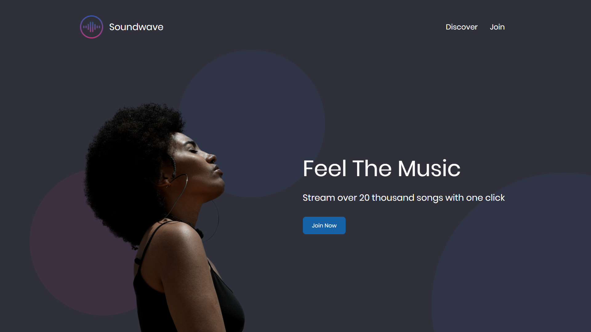
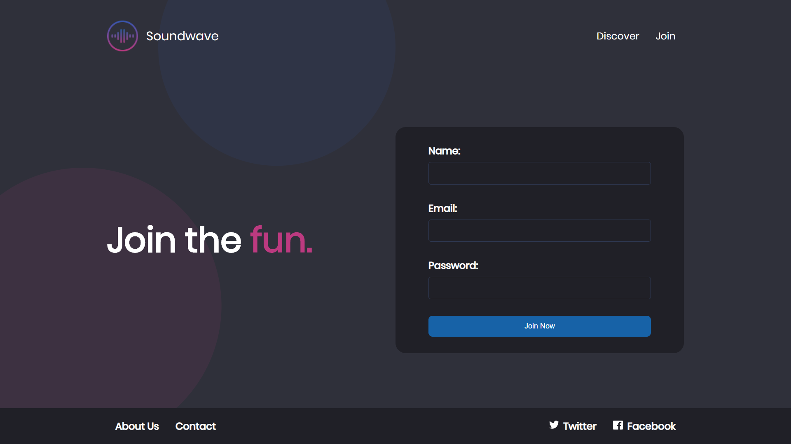

## Web Dev Spotify Type Landing Page CSS Tutorial

This landing page is another great [tutorial](https://www.youtube.com/watch?v=RZ-Oe4_Ew7g&list=PLZlA0Gpn_vH8mpXIUHjWoMAAgoCEinL0R&index=3&t=0s) from [Web Dev Simplified](https://www.youtube.com/channel/UCFbNIlppjAuEX4znoulh0Cw/playlists). It is a Spotify type landing page. None of the code is mine, the only thing I changed from the original is the layout of the style.css and the header.css (using @import).

This is the opening page:

Clicking on the discover link takes the user to the discover page:

Finally, clicking on 'join' takes the viewer to the join page:

My rendition of this tutorial is [published on GitHub](https://martucazpo.github.io/spotify-type-web-page/).